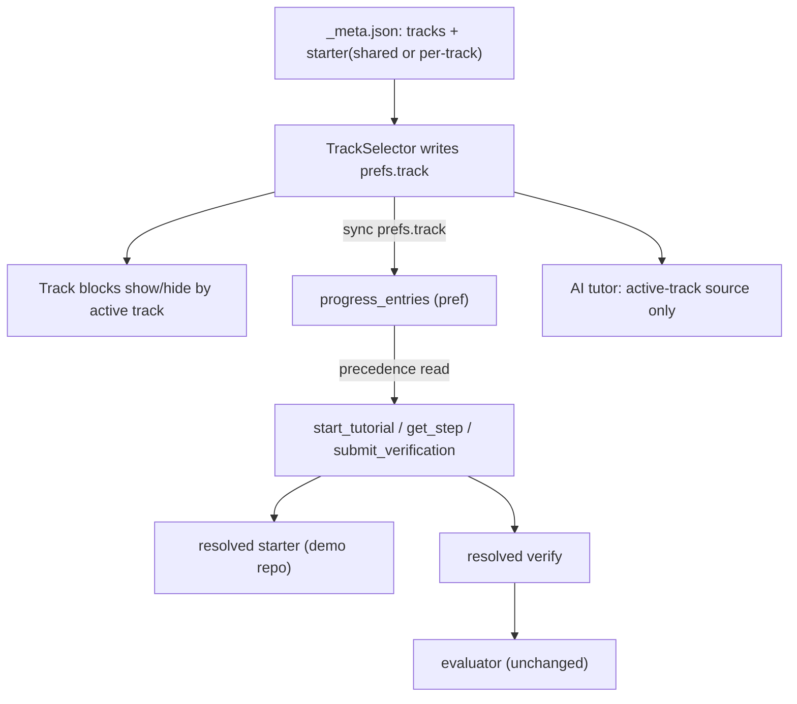

# Multi-language tutorials

Add a per-tutorial **track** axis (programming-language variant) so one tutorial serves, e.g., a Python track and a TypeScript track without duplication. A track governs snippets, `verify` tests, and the `starter`/demo repo. Today the only switcher is `<Tabs group>` in [packages/core/src/components/mdx/Tabs.astro](packages/core/src/components/mdx/Tabs.astro), and `verify`/`starter` are single-valued.

Terminology: **track** = the learner's chosen variant; **lang** stays reserved for fence syntax / the AI code-block filter (see [CONTEXT.md](CONTEXT.md)). Key decisions are recorded in [docs/adr/0001-tutorial-tracks.md](docs/adr/0001-tutorial-tracks.md), [docs/adr/0002-track-resolution-over-mcp.md](docs/adr/0002-track-resolution-over-mcp.md), and [docs/adr/0003-single-page-track-rendering.md](docs/adr/0003-single-page-track-rendering.md).

## Resolved decisions

- **Naming**: `track` (not `lang`), to avoid colliding with fence-syntax `lang`.
- **One control**: a single global, persisted `TrackSelector`. No inline track tabs; `<Tabs>` stays orthogonal (pm/OS).
- **Resolution precedence**: explicit `track` > persisted `prefs.track` (if offered by this tutorial) > `defaultTrack` > first declared.
- **No clobber**: a global `prefs.track` not offered by the current tutorial resolves to a fallback for display only; only a selector click writes `prefs.track`. Gives cross-tutorial stickiness when track ids overlap.
- **Strict coverage**: per-track `verify`/`starter` maps must cover every declared track (build error otherwise). Inline `<Track>` content blocks may target a subset.
- **Single page**: each step prerenders all tracks' content; active track shown/hidden client-side with a pre-paint script. No per-track routes.
- **Shared progress**: checkpoints/steps/quizzes stay track-agnostic; passing any track's verify completes the shared `scope:"global"` checkpoint. Progress keys unchanged.
- **AI track-aware (minimal)**: inject active track + send only active-track source to the tutor.

## Data model

In [packages/core/src/collections.ts](packages/core/src/collections.ts):

- Tutorial `_meta.json`: add `tracks` — ordered `[{ id, label }]` (e.g. `[{id:"py",label:"Python"},{id:"ts",label:"TypeScript"}]`) and optional `defaultTrack`.
- `starter`: accept the existing single `StarterSpec` (back-compat / shared) OR a `Record<trackId, StarterSpec>`.
- Step `verify`: accept a single `VerifySpec` (shared) OR a `Record<trackId, VerifySpec>`.
- Add `resolveForTrack(specOrMap, track)` helper used by MCP, landing page, and AI.
- `stepsLoader` (lines 99-129): validate every per-track variant's `verify.id` against `<Checkpoint>` ids, and enforce that per-track maps cover all declared tracks and use only declared track ids.

## Persisted global selector

- Add `track?: string` to `prefs` in [packages/core/src/lib/progress/types.ts](packages/core/src/lib/progress/types.ts). No `STORAGE_KEY` bump (forward-compatible spread-merge). Reuse `setPref` in [packages/core/src/lib/progress/useProgress.ts](packages/core/src/lib/progress/useProgress.ts) (lines 71-72).
- New `TrackSelector` island, fed `tutorial.tracks`, placed in [packages/core/src/components/StepNav.astro](packages/core/src/components/StepNav.astro) or the Sidebar; hidden when `tracks.length < 2`. Writes `prefs.track` on explicit click only.
- Pre-paint inline script reads the resolved track from `localStorage` (`handzon:v1`) and sets the active-track attribute before first paint to avoid a flash of the wrong track.

## Content / snippets

- New `<Track id="py">...</Track>` MDX component (`packages/core/src/components/mdx/Track.astro`) — renders its slot, hidden unless the active track matches; same show/hide mechanism as [Tab.astro](packages/core/src/components/mdx/Tab.astro). Authors wrap only the parts that differ; track-neutral content stays unwrapped.
- Code fences (Shiki) and `<Playground>` ([Playground.tsx](packages/core/src/components/mdx/Playground.tsx)) work unchanged; place per-track variants inside `<Track>`. No Sandpack changes (still JS/TS at runtime).
- `<Tabs>` is NOT bridged to tracks; it remains for package-manager/OS variants.

## Tests (verify) + demo repo (starter) over MCP

The agent is a separate process, so the active track is resolved by precedence server-side (it can read the learner's persisted `prefs.track`):

- `start_tutorial` ([packages/core/src/server/mcp/startTutorial.ts](packages/core/src/server/mcp/startTutorial.ts)): add optional `track` input; resolve the per-track `starter` before `buildCommands`/`resolveTargetDir`.
- `get_step` ([packages/core/src/server/mcp/tools.ts](packages/core/src/server/mcp/tools.ts)) and `submit_verification` ([packages/core/src/server/mcp/writeTools.ts](packages/core/src/server/mcp/writeTools.ts)): resolve the per-track `VerifySpec` via precedence. `submit_verification` already has `ctx.learnerId`; give `start_tutorial`/`get_step` optional learner context for the `prefs.track` lookup. The server-side evaluator is unchanged (it scores one resolved spec).
- Checkpoint UI ([Checkpoint.astro](packages/core/src/components/mdx/Checkpoint.astro)) stays track-agnostic; checkpoint ids are shared across tracks.

## AI tutor

- In [ChatPanel.tsx](packages/core/src/components/ai/ChatPanel.tsx) / AI context assembly ([packages/ai/src/tools.ts](packages/ai/src/tools.ts)): inject the active track and strip non-active `<Track>` regions from `currentStep.source` (and prior steps) before sending, so the tutor doesn't quote another track's code.

## Authoring + docs

- Update `wire-tutorial-starter` and `add-playground` skills + `AGENTS.md` in `templates/default` to document `tracks`, `<Track>`, and per-track `starter`/`verify`.
- Add one multi-track sample tutorial exercising snippets, tests, and starter.

## Flow

## Back-compat

Tutorials without `tracks`, and single-valued `starter`/`verify`, behave exactly as today; the selector only appears when `tracks.length >= 2`.
