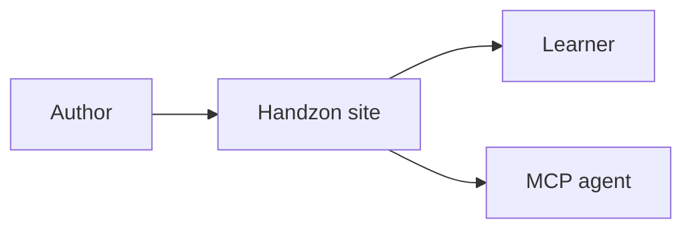

Handzon registers MDX components globally. Do not import them in tutorial steps.

## Static components

### Callout

Use callouts for short notes:

```mdx
<Callout type="info">Heads up.</Callout>
<Callout type="tip">A nudge in the right direction.</Callout>
<Callout type="warn">Stop and read this.</Callout>
<Callout type="danger">Do not do this in production.</Callout>
```

### Hint

Use hints for collapsible help:

```mdx
<Hint title="Stuck? Reveal a clue">
Try checking the server logs first.
</Hint>
```

### Steps and Step

Use nested steps for sub-procedures inside a page:

```mdx
<Steps>
  <Step title="Install dependencies">Run `pnpm install`.</Step>
  <Step title="Start the app">Run `pnpm dev`.</Step>
</Steps>
```

### File

Use `File` to label filenames inline:

```mdx
Open <File path="src/app.ts" /> and add the route.
```

Expressive Code's `title="..."` is also supported on code fences.

### Recap

Use a recap at the end of a step:

```mdx
<Recap items={[
  "Created the project",
  "Started the dev server",
  "Found the next file to edit"
]} />
```

### Embed

Use embeds for inline video or slide decks:

```mdx
<Embed
  type="slides"
  src="https://docs.google.com/presentation/d/abc123/embed"
  title="Architecture deck"
  slide="4"
/>
```

### Download

Use downloads for stable files in `public/downloads/`:

```mdx
<Download href="/downloads/starter.zip">Download the starter archive</Download>
```

### Track

Use `Track` for tutorial-wide programming-language variants:

````mdx
<Track id="py">

```python title="app.py"
print("Hello from Python")
```

</Track>
````

See [Multi-Language Tracks](/guides/tracks/) for full guidance.

## Interactive components

### Tabs and Tab

Use tabs for local choices:

```mdx
<Tabs items={[{ label: "npm", value: "npm" }, { label: "pnpm", value: "pnpm" }]} group="pm">
  <Tab value="npm">Run `npm install`.</Tab>
  <Tab value="pnpm">Run `pnpm install`.</Tab>
</Tabs>
```

Use `group` when the selection should persist across pages.

### FileTree

Show project structure:

```mdx
<FileTree paths={[
  "src/app.ts",
  "src/routes/index.ts",
  "package.json"
]} />
```

### Reveal

Hide optional solutions behind a click:

```mdx
<Reveal label="Show solution">
The solution goes here.
</Reveal>
```

### Terminal

Render fake terminal sessions:

```mdx
<Terminal entries={[
  { command: "pnpm build" },
  { output: "Build completed." }
]} />
```

### Mermaid

Use a fenced `mermaid` block for static diagrams:



Use `<Mermaid>` only when the diagram needs runtime state.

### Diff

Use `Diff` for before/after code comparisons:

```mdx
<Diff
  before={`function add(a, b) {
  return a + b;
}`}
  after={`function add(a: number, b: number) {
  return a + b;
}`}
/>
```

Use a `diff` code fence when a static patch is enough.

### Quiz

Use quizzes to check one concept:

```mdx
<Quiz
  question="What gates the Next button?"
  options={["A Checkpoint", "A title", "A code fence"]}
  answer={0}
  explanation="A step checkpoint gates the Next button when the tutorial is gated."
/>
```

### Checkpoint

Use checkpoints to record progress:

```mdx
<Checkpoint id="app/tests-pass" label="The tests pass." />
```

The `id` must match `verify.id` when the step has machine-verifiable checks.

### Playground

Use Sandpack playgrounds for JavaScript or TypeScript exercises:

```mdx
<Playground template="react-ts" files={{
  "/App.tsx": `export default function App() {
  return <h1>Hello from a tutorial!</h1>;
}`,
}} />
```

Playgrounds are JS/TS only in the current version.
