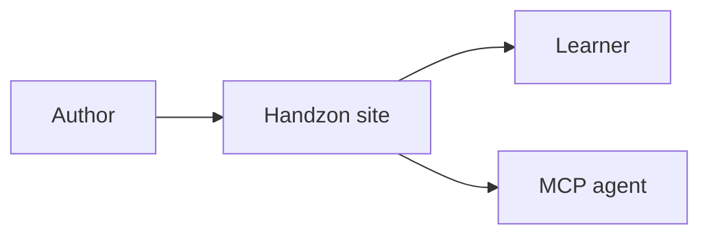

Handzon registers MDX components globally. Do not import them in tutorial steps.

## Static components

### Callout

Use callouts for short notes:

```mdx
<Callout type="info">Heads up.</Callout>
<Callout type="tip">A nudge in the right direction.</Callout>
<Callout type="warn">Stop and read this.</Callout>
<Callout type="danger">Do not do this in production.</Callout>
```

### Hint

Use hints for collapsible help:

```mdx
<Hint title="Stuck? Reveal a clue">
Try checking the server logs first.
</Hint>
```

### Collapsible

Use a collapsible section for optional or supporting detail the learner can skip. Unlike `Hint`, it carries no "answer" framing, so it suits asides, extra background, or long output. Add `open` to start expanded, and `icon` with a [lucide](https://lucide.dev/icons/) icon name to show a glyph before the title:

```mdx
<Collapsible title="Why does this work?" icon="brain">
The runtime walks the tree and resolves each node in order.
</Collapsible>
```

### Icon

Render an inline [lucide](https://lucide.dev/icons/) icon by name. Icons are server-rendered to static SVG, so they ship no client JS:

```mdx
Click the <Icon name="rocket" /> button to deploy.
```

`Collapsible` and `Recap` accept the same icon names through their `icon` prop.

### Steps and Step

Use nested steps for sub-procedures inside a page:

```mdx
<Steps>
  <Step title="Install dependencies">Run `pnpm install`.</Step>
  <Step title="Start the app">Run `pnpm dev`.</Step>
</Steps>
```

### File

Use `File` to label filenames inline:

```mdx
Open <File path="src/app.ts" /> and add the route.
```

Expressive Code's `title="..."` is also supported on code fences.

### Figure

Use `Figure` for images that need a border and an optional caption. Set `width` to constrain the image:

```mdx
<Figure
  src="./assets/dashboard.png"
  alt="The deploy dashboard after a successful build"
  caption="The dashboard shows a green build once the deploy finishes."
  width={640}
/>
```

A `src` that points at a co-located asset under the tutorial's `assets/` directory is resolved and optimized through `astro:assets` automatically — no import needed, the same way `heroMedia` frontmatter resolves. Files in `public/` and remote URLs render as a plain image. You can also pass an imported asset directly if you prefer.

Plain markdown images (``) also get the border, but only `Figure` renders a caption.

### Recap

Use a recap at the end of a step:

```mdx
<Recap items={[
  "Created the project",
  "Started the dev server",
  "Found the next file to edit"
]} />
```

Pass `icon` with a [lucide](https://lucide.dev/icons/) icon name to swap the default checkmark, or `icon="none"` to drop it:

```mdx
<Recap icon="target" items={["You shipped the feature"]} />
<Recap icon="none" items={["No icon on this one"]} />
```

### Embed

Use embeds for inline video or slide decks:

```mdx
<Embed
  type="slides"
  src="https://docs.google.com/presentation/d/abc123/embed"
  title="Architecture deck"
  slide="4"
/>
```

### Download

Use downloads for stable files in `public/downloads/`:

```mdx
<Download href="/downloads/starter.zip">Download the starter archive</Download>
```

### Button

Use a button for a prominent call to action, such as a download link or an outbound resource. Set `variant` for the visual style, `color` for the tone, and `icon` for a leading or trailing icon.

```mdx
<Button href="/downloads/starter.zip" icon="download">Download the starter</Button>
<Button href="https://render.com/docs" variant="secondary" icon="external-link">Read the docs</Button>
<Button href="/guides/tracks/" variant="ghost" color="info" icon="arrow-right">Next guide</Button>
```

The `variant` prop accepts `primary` (filled), `secondary` (outline), and `ghost` (text only). The `color` prop accepts `accent`, `info`, `success`, `warn`, and `danger`, and maps to theme tokens. The `icon` prop takes any [lucide](https://lucide.dev/icons/) icon name in kebab-case. Trailing icons like `external-link` and `arrow-right` sit on the right by default. Set `iconPosition` to override, and `size="sm"` for a compact button.

A button with an `http` or `https` `href` opens in a new tab automatically. Omit `href` to render a plain `<button>` element.

### Badge

Use a badge for a short inline label, such as a status or version tag. Set `color` for the tone and `variant` for the fill style.

```mdx
<Badge color="success">New</Badge>
<Badge color="warn" variant="solid">Beta</Badge>
<Badge color="neutral" variant="outline">v2.1</Badge>
```

The `color` prop accepts `accent`, `info`, `success`, `warn`, `danger`, and `neutral`. The `variant` prop accepts `soft` (default), `solid`, and `outline`.

### Kbd

Use `Kbd` to render keyboard shortcuts. Pass `keys` for a combination, or a single key as children.

```mdx
Press <Kbd keys={["Cmd", "K"]} /> to open the command menu, or <Kbd>Esc</Kbd> to close it.
```

### Card and CardGrid

Use cards for "next steps" or related links. Set `href` to make a card a link, `title` for the heading, and `icon` for a [lucide](https://lucide.dev/icons/) icon name. Wrap cards in `CardGrid` for a responsive layout.

```mdx
<CardGrid>
  <Card title="Quick start" href="/guides/quick-start/" icon="rocket">
    Get a tutorial running in two minutes.
  </Card>
  <Card title="Read the docs" href="https://render.com/docs" icon="book-open">
    Browse the full reference.
  </Card>
</CardGrid>
```

A card with an `http` or `https` `href` opens in a new tab automatically and shows an outbound indicator. Set `columns` on `CardGrid` for a fixed column count; omit it for an auto-fit layout.

### Track

Use `Track` for tutorial-wide programming-language variants:

````mdx
<Track id="py">

```python title="app.py"
print("Hello from Python")
```

</Track>
````

See [Multi-Language Tracks](/guides/tracks/) for full guidance.

## Interactive components

### Tabs and Tab

Use tabs for local choices:

```mdx
<Tabs items={[{ label: "npm", value: "npm" }, { label: "pnpm", value: "pnpm" }]} group="pm">
  <Tab value="npm">Run `npm install`.</Tab>
  <Tab value="pnpm">Run `pnpm install`.</Tab>
</Tabs>
```

Use `group` when the selection should persist across pages.

### FileTree

Show project structure:

```mdx
<FileTree paths={[
  "src/app.ts",
  "src/routes/index.ts",
  "package.json"
]} />
```

### Reveal

Hide optional solutions behind a click:

```mdx
<Reveal label="Show solution">
The solution goes here.
</Reveal>
```

### Terminal

Render fake terminal sessions:

```mdx
<Terminal entries={[
  { command: "pnpm build" },
  { output: "Build completed." }
]} />
```

### Mermaid

Use a fenced `mermaid` block for static diagrams:



Use `<Mermaid>` only when the diagram needs runtime state.

### Diff

Use `Diff` for before/after code comparisons:

```mdx
<Diff
  before={`function add(a, b) {
  return a + b;
}`}
  after={`function add(a: number, b: number) {
  return a + b;
}`}
/>
```

Use a `diff` code fence when a static patch is enough.

### Quiz

Use quizzes to check one concept:

```mdx
<Quiz
  id="gating/next-button"
  question="What gates the Next button?"
  options={["A Checkpoint or Quiz", "A title", "A code fence"]}
  answer={0}
  explanation="A checkpoint or quiz gates the Next button when the tutorial is gated."
/>
```

### Checkpoint

Use checkpoints to record progress:

```mdx
<Checkpoint id="app/tests-pass" label="The tests pass." />
```

The `id` must match `verify.id` when the step has machine-verifiable checks.

### Playground

Use Sandpack playgrounds for JavaScript or TypeScript exercises:

```mdx
<Playground template="react-ts" files={{
  "/App.tsx": `export default function App() {
  return <h1>Hello from a tutorial!</h1>;
}`,
}} />
```

Playgrounds are JS/TS only in the current version.
