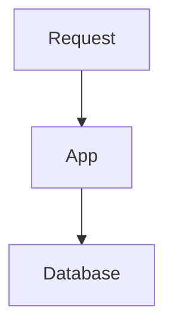

Handzon uses Expressive Code for fenced code blocks. You get syntax highlighting, filename labels, line highlights, diff markers, and copy-to-clipboard behavior.

## Titles

Add `title="..."` to show a filename or terminal label:

````
```ts title="src/lib/math.ts"
export function add(a: number, b: number) {
  return a + b;
}
```
````

Use descriptive titles:

- `src/app.ts`
- `Terminal`
- `render.yaml`
- `diff: add health check`

## Line highlights

Highlight individual lines or ranges:

````
```ts title="src/lib/math.ts" {2,4-5}
export function add(a: number, b: number) {
  return a + b;
}

export function mul(a: number, b: number) {
  return a * b;
}
```
````

## Diffs

Use `diff` fences for patch-like snippets:

````
```diff lang="ts" title="diff: tighten types"
- function add(a, b) {
+ function add(a: number, b: number) {
    return a + b;
  }
```
````

## Languages

The fence language controls syntax highlighting only:

````
```python
print("Hello")
```

```ts
console.log("Hello");
```
````

Do not use fence language to mean the learner's chosen tutorial track. Use [tracks](/guides/tracks/) for tutorial-wide language variants.

## Mermaid diagrams

Use a `mermaid` fence for static diagrams:

````

````

Use the `<Mermaid>` component only when the diagram needs runtime state.
