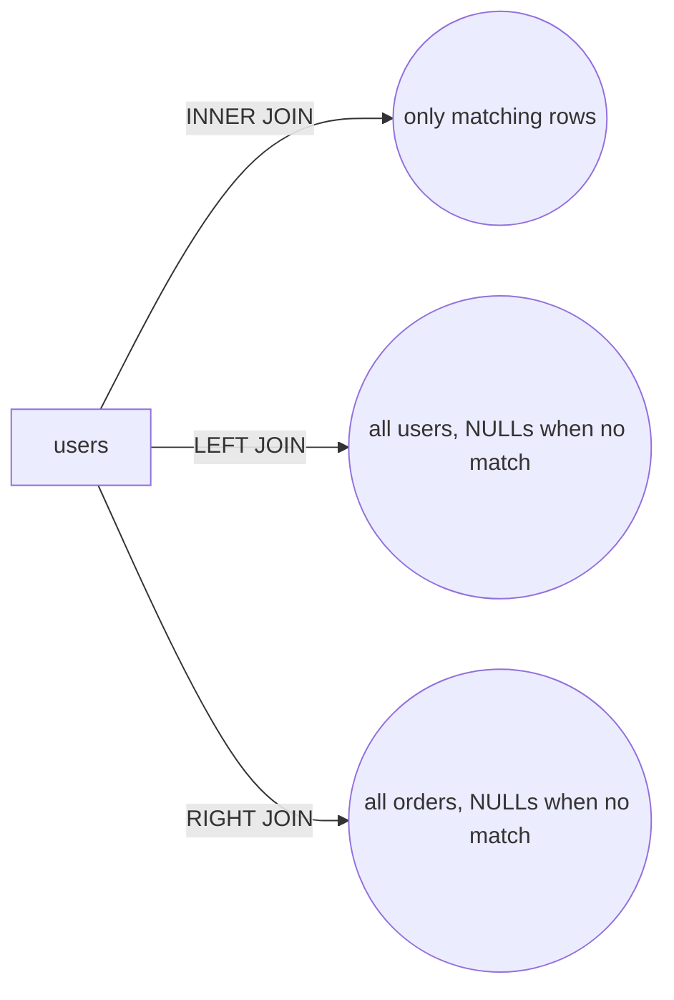

A join combines rows from two tables based on a related column.

## The shapes



## INNER JOIN — only matches

```sql title="Find each user with at least one order"
SELECT u.name, o.total
FROM users u
INNER JOIN orders o ON o.user_id = u.id;
```

Users with no orders **disappear** from the result.

## LEFT JOIN — keep the left side

```sql title="All users, even ones with no orders"
SELECT u.name, o.total
FROM users u
LEFT JOIN orders o ON o.user_id = u.id;
```

`o.total` is `NULL` for users with no matching order. That's the giveaway you're looking at a left-join result.

<Reveal label="When would you use a RIGHT JOIN?">
Almost never in practice — you can always rewrite it as a `LEFT JOIN` with the tables swapped. Some teams ban `RIGHT JOIN` from their codebase for exactly this reason.
</Reveal>

<Quiz
  question="A query returns rows where one side has NULLs in every column. What does that tell you?"
  options={[
    "There's a bug in the data",
    "It's an outer join (LEFT or RIGHT) and the unmatched side is the one with NULLs",
    "It's an INNER JOIN with bad indexes",
    "The query is using DISTINCT"
  ]}
  answer={1}
  explanation="Outer joins fill missing matches with NULLs. INNER joins simply drop unmatched rows."
/>

<Checkpoint label="I can pick the right join shape for 'all X with their Ys'." />

<Recap items={[
  "INNER JOIN keeps only matches",
  "LEFT JOIN keeps every row on the left, NULL-fills the right",
  "RIGHT JOIN is rarely used in practice"
]} />
