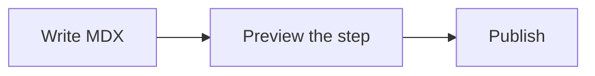
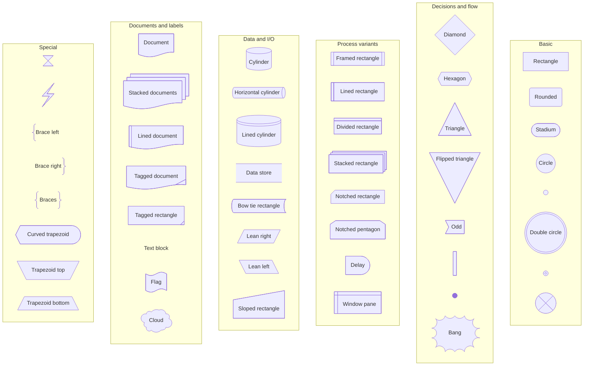

Mermaid fences turn text into diagrams. Use them when the learner needs to see a flow, state change, dependency graph, or architecture map.

## The syntax

Use a fenced `mermaid` block. The site renders it with the active theme.

````mdx

````

## All flowchart shapes

Mermaid v11.3 and newer supports a shape object on any flowchart node. The shape name goes in `shape`; the visible text goes in `label`.



## Pick a shape

- Use `rect`, `rounded`, or `stadium` for normal steps.
- Use `diam` for a decision.
- Use `cyl`, `datastore`, `doc`, or `docs` when the node is data or content.
- Use `fork`, `f-circ`, `dbl-circ`, or `fr-circ` for start, stop, and branch markers.
- Use `brace`, `brace-r`, `braces`, `text`, or `tag-doc` when the diagram needs annotations.

<Callout type="tip">
Keep node IDs short and boring. Put readable text in `label` so punctuation and spaces do not break the parser.
</Callout>

## Diagram families

Flowcharts are the common case, but Mermaid can render other families too:

- `sequenceDiagram` for request and response flows.
- `stateDiagram-v2` for lifecycle states.
- `classDiagram` and `erDiagram` for data models.
- `gantt`, `timeline`, and `journey` for planning and user paths.
- `mindmap`, `kanban`, `xychart-beta`, and `sankey-beta` for specialized views.

<Checkpoint id="mermaid-diagrams/themed-diagram" label="I can add a themed Mermaid diagram to a tutorial step." />

<Recap items={[
  "Use fenced mermaid blocks for static diagrams",
  "Use shape object syntax when you need a specific flowchart node shape",
  "Keep node IDs simple and put reader-facing text in labels"
]} />
