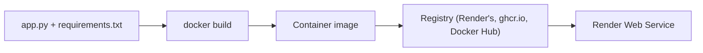

A Dockerfile makes your app deployable anywhere that runs containers — Render, Fly, Cloud Run, your laptop.

## Architecture



## The Dockerfile

```dockerfile title="Dockerfile"
# syntax=docker/dockerfile:1.7
FROM python:3.12-slim AS base
WORKDIR /app

# Install deps first so layer is cached when only app code changes
COPY requirements.txt .
RUN pip install --no-cache-dir -r requirements.txt

# Copy the app
COPY app.py .

# Render injects PORT at runtime; default to 8000 locally
ENV PORT=8000
EXPOSE 8000

CMD ["python", "app.py"]
```

```txt title="requirements.txt"
flask==3.0.3
```

## Build + run

<Tabs items={[
  { label: "macOS", value: "mac" },
  { label: "Linux", value: "linux" },
  { label: "Windows", value: "win" }
]} group="os">
  <Tab value="mac">
    ```bash title="Terminal"
    docker build -t my-api .
    docker run -p 8000:8000 my-api
    ```
  </Tab>
  <Tab value="linux">
    ```bash title="Terminal"
    docker build -t my-api .
    docker run -p 8000:8000 my-api
    ```
  </Tab>
  <Tab value="win">
    ```powershell title="PowerShell"
    docker build -t my-api .
    docker run -p 8000:8000 my-api
    ```
  </Tab>
</Tabs>

<Terminal entries={[
  { command: "docker build -t my-api ." },
  { output: "[+] Building 5.2s (10/10) FINISHED" },
  { command: "docker run -p 8000:8000 my-api" },
  { output: " * Running on http://0.0.0.0:8000" }
]} />

<Reveal label="What does `--no-cache-dir` do, and why use it?">
It tells `pip` not to cache wheels under `~/.cache/pip`. In a Docker image, that cache is dead weight — it bloats the layer with files you'll never reuse.
</Reveal>

<Quiz
  id="dockerize/layer-cache"
  question="Why does the Dockerfile copy requirements.txt BEFORE app.py?"
  options={[
    "It's required syntax",
    "So the pip install layer can be cached and reused when only app code changes",
    "To prevent timing attacks",
    "It doesn't matter"
  ]}
  answer={1}
  explanation="Docker invalidates layers from the changed COPY downwards. Copying requirements.txt first means pip install only re-runs when deps actually change."
/>

<Checkpoint id="dockerize/container-healthz" label="I can curl http://localhost:8000/healthz from inside Docker." />

<Recap items={[
  "Wrote a multi-stage-ready Dockerfile",
  "Used layer ordering to maximize build cache hits",
  "Verified the container responds locally"
]} />
